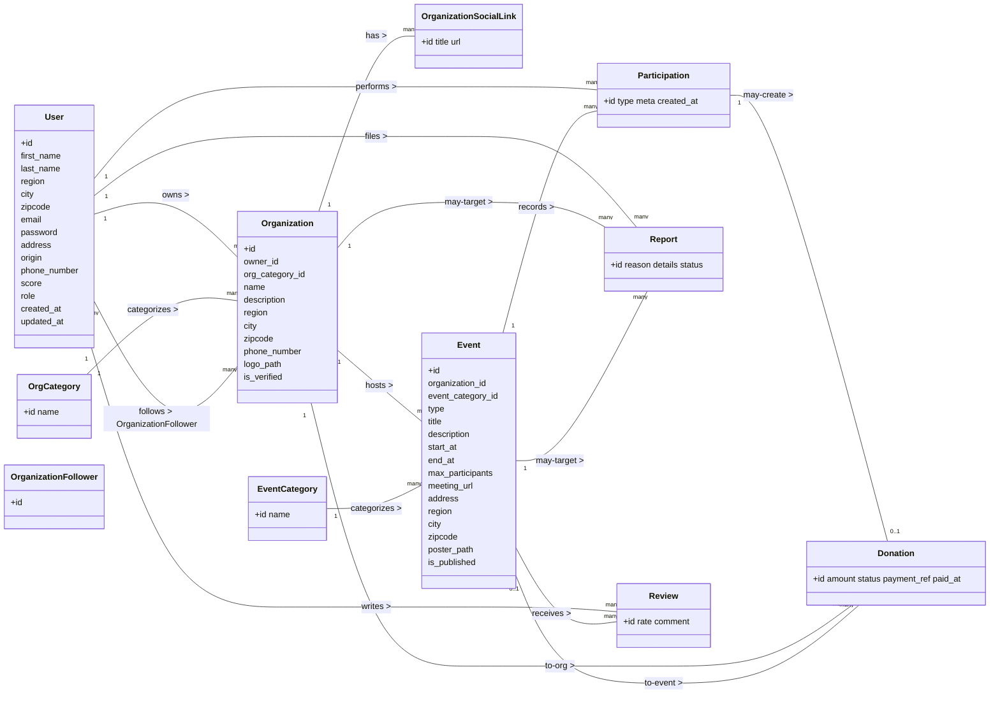

# TounsiVert – Functional & Data Model Specification (Laravel)

**Theme:** Tunisian platform for organizing and supporting impact-driven events (feeding people, war/relief donations, helping the poor, mosque building, tree planting, city cleanups…).

**Audience:** Citizens, associations/NGOs, mosques/collectives, municipalities, sponsors.

**Goal:** Enable users in Tunisia to **discover**, **join (onsite)**, **support/follow**, **share**, and **donate** to events and organizations. Track **impact** via scores and reporting.

---
Recommended Stack for TounsiVert
Backend

Laravel 10+ (PHP 8.2+) → main framework.

MySQL / MariaDB → relational DB for structured data.

Eloquent ORM → for handling models and relationships.

Spatie Laravel-Permission → roles (admin, organizer, member).

Laravel Breeze/Jetstream → authentication & scaffolding.

Frontend (IT points / Blade integration)

Blade Templates → Laravel’s native templating system.

Bootstrap 5 (or TailwindCSS, but usually schools prefer Bootstrap).

Alpine.js (optional lightweight interactivity).

(Optionally Vue/React if required, but Blade+Bootstrap is often enough).


## 1) Context & Vision

TounsiVert is a community platform with a Tunisian touch focused on local impact:

* Online & onsite events, categorized (Relief, Food Aid, Mosque Building, Health, Education, Environment: Planting, Cleaning, Recycling).
* Users join onsite actions, donate online, follow organizations, share campaigns, rate/review events, and report issues.
* Organizers publish events, manage participants, and receive donations.
* Admins moderate content, verify organizations, and review reports.

**Why now?** Many local initiatives exist but are fragmented across social media. TounsiVert centralizes actions, builds transparency and participation, and measures impact.

---

## 2) Roles & Access

* **Visitor**: Browse public events/organizations.
* **Member (User)**: Join events, donate, follow/share, post reviews, submit reports.
* **Organizer**: Manages an organization profile and its events, sees participants/donations, exports lists.
* **Admin**: Full CRUD + moderation (verify orgs, resolve reports, remove abuse).

> Note: Authentication/authorization can be handled with Laravel Breeze/Jetstream and (optionally) Spatie Roles & Permissions. This spec centers on the 6 core modules excluding user-auth code.

---

## 3) Core Modules (mapped to 6 team members)

1. **Organizations & Org Categories**
2. **Events & Event Categories**
3. **Participations & Attendance**
4. **Donations**
5. **Reviews**
6. **Reports (Moderation) & Impact Score**

> (Impact Score is computed from participations/donations/shares/follows and stored on `users.score`).

---

## 4) Use Cases (Primary)

### UC-01 – Browse Events

**Actor:** Visitor/Member
**Pre:** Events exist and are public.
**Flow:** Filter by category/region/date/type → open event detail → see slots, description, organizer, reviews.
**Post:** (Optional) User registers/follows/donates.

### UC-02 – Organize an Event

**Actor:** Organizer
**Pre:** Organizer owns a verified organization.
**Flow:** Create event (title, category, type: online/onsite/hybrid, datetime, location, max participants, poster) → publish.
**Post:** Event visible, members can engage.

### UC-03 – Join/Follow/Share Event

**Actor:** Member
**Flow:** Click **Join** (onsite), or **Follow**, or **Share** → system records a `participation` with type (attend/follow/share).
**Post:** User score updated.

### UC-04 – Donate to Event/Organization

**Actor:** Member
**Flow:** From event/org page → input amount → create `participation` (type donation) → create `donation` (pending) → mark success/failure (by gateway or admin).
**Post:** Score updated; donation recorded.

### UC-05 – Review Event

**Actor:** Member (who joined or attended)
**Flow:** Submit rating (1–5) + comment → moderation if needed.
**Post:** Review appears on event page.

### UC-06 – Report Issue

**Actor:** Any Member
**Flow:** File a report (spam/abuse/misinformation/safety) against event or organization.
**Post:** Admin investigates → status updated (in_review, resolved, dismissed).

### UC-07 – Admin Moderation

**Actor:** Admin
**Flow:** Verify organizations, manage events, resolve reports, export CSVs, manage reviews/donations if disputes occur.

---

## 5) Data Modeling Conventions

* **Naming:** snake_case table/column names; singular Eloquent model names.
* **Timestamps:** All core tables use `id` (bigint, AI), `created_at`, `updated_at`. Optional `deleted_at` (soft deletes).
* **Enums:** Use MySQL `ENUM` or string + validation. Suggested enums below.
* **Geo:** `region`, `city`, `zipcode` kept as strings for MVP; can normalize later into lookup tables.

---

## 6) Enumerations & Reference Values

* **event.type**: `online`, `onsite`, `hybrid`
* **participation.type**: `attend`, `donation`, `follow`, `share`
* **donations.status**: `pending`, `succeeded`, `failed`, `refunded`
* **reports.status**: `open`, `in_review`, `resolved`, `dismissed`
* **reviews.rate**: integer 1..5

**Impact Score (suggested weights):**

* attend: **+10** points
* donation: **+1 per 1 TND** (amount rounded)
* follow: **+1**
* share: **+2**

> Keep a job to recompute periodically or compute incrementally on events.

---

## 7) Tables & Columns (Finalized)

Below are **normalized** versions of your proposed tables, ready for Laravel migrations.

### 7.1 users *(already provided, refined)*

```
users(
  id BIGINT PK,
  first_name VARCHAR(100),
  last_name VARCHAR(100),
  region VARCHAR(120) NULL,
  city VARCHAR(120) NULL,
  zipcode VARCHAR(20) NULL,
  email VARCHAR(191) UNIQUE,
  password VARCHAR(255),
  address VARCHAR(255) NULL,
  origin VARCHAR(120) NULL,            -- optional: hometown/origin
  phone_number VARCHAR(30) NULL,
  score INT DEFAULT 0,
  role ENUM('member','organizer','admin') DEFAULT 'member',
  email_verified_at TIMESTAMP NULL,
  remember_token VARCHAR(100) NULL,
  created_at, updated_at, deleted_at NULL
)
INDEX: (region), (city), (score DESC)
```

### 7.2 org_categories (OrgCategory)

```
org_categories(
  id BIGINT PK,
  name VARCHAR(120) UNIQUE,
  created_at, updated_at
)
```

### 7.3 organizations

```
organizations(
  id BIGINT PK,
  owner_id BIGINT FK → users.id,
  org_category_id BIGINT FK → org_categories.id,
  name VARCHAR(150),
  description TEXT NULL,
  address VARCHAR(255) NULL,
  region VARCHAR(120) NULL,
  city VARCHAR(120) NULL,
  zipcode VARCHAR(20) NULL,
  phone_number VARCHAR(30) NULL,
  logo_path VARCHAR(255) NULL,
  is_verified BOOLEAN DEFAULT FALSE,
  created_at, updated_at, deleted_at NULL
)
INDEX: (org_category_id), (region), (city)
```

### 7.4 organization_social_links *(List of {title, link})*

```
organization_social_links(
  id BIGINT PK,
  organization_id BIGINT FK → organizations.id,
  title VARCHAR(60),         -- e.g., Facebook, Instagram, Site Web
  url VARCHAR(255),
  created_at, updated_at
)
UNIQUE (organization_id, title)
```

### 7.5 organization_followers *(followers <List users>)*

```
organization_followers(
  id BIGINT PK,
  organization_id BIGINT FK → organizations.id,
  user_id BIGINT FK → users.id,
  created_at, updated_at
)
UNIQUE (organization_id, user_id)
```

### 7.6 event_categories

```
event_categories(
  id BIGINT PK,
  name VARCHAR(120) UNIQUE,
  created_at, updated_at
)
```

### 7.7 events

```
events(
  id BIGINT PK,
  organization_id BIGINT FK → organizations.id,
  event_category_id BIGINT FK → event_categories.id,
  type ENUM('online','onsite','hybrid') NOT NULL,
  title VARCHAR(150),
  description TEXT NULL,
  start_at DATETIME,
  end_at DATETIME NULL,
  max_participants INT NULL,
  meeting_url VARCHAR(255) NULL,       -- for online/hybrid
  address VARCHAR(255) NULL,           -- for onsite/hybrid
  region VARCHAR(120) NULL,
  city VARCHAR(120) NULL,
  zipcode VARCHAR(20) NULL,
  poster_path VARCHAR(255) NULL,
  is_published BOOLEAN DEFAULT TRUE,
  created_at, updated_at, deleted_at NULL
)
INDEX: (event_category_id), (start_at), (region, city)
CHECK: end_at IS NULL OR end_at >= start_at
```

### 7.8 participations *(Type: Donation, Follow, Attend, Share)*

```
participations(
  id BIGINT PK,
  user_id BIGINT FK → users.id,
  event_id BIGINT FK → events.id,
  type ENUM('attend','donation','follow','share') NOT NULL,
  meta JSON NULL,                        -- e.g., share platform, notes
  created_at, updated_at
)
UNIQUE (user_id, event_id, type)         -- prevents duplicates per type
INDEX: (event_id), (user_id, type)
```

### 7.9 donations

```
donations(
  id BIGINT PK,
  participation_id BIGINT FK → participations.id,
  organization_id BIGINT FK → organizations.id NULL, -- redundancy helpful for reports
  event_id BIGINT FK → events.id NULL,
  amount DECIMAL(12,2) NOT NULL,
  status ENUM('pending','succeeded','failed','refunded') DEFAULT 'pending',
  payment_ref VARCHAR(191) NULL,        -- gateway reference/txn id
  paid_at DATETIME NULL,
  created_at, updated_at
)
INDEX: (status), (organization_id), (event_id), (paid_at)
```

### 7.10 reports

```
reports(
  id BIGINT PK,
  user_id BIGINT FK → users.id,
  organization_id BIGINT FK → organizations.id NULL,
  event_id BIGINT FK → events.id NULL,
  reason VARCHAR(200) NULL,
  details TEXT NULL,
  status ENUM('open','in_review','resolved','dismissed') DEFAULT 'open',
  created_at, updated_at
)
INDEX: (status), (organization_id), (event_id)
```

### 7.11 reviews

```
reviews(
  id BIGINT PK,
  user_id BIGINT FK → users.id,
  event_id BIGINT FK → events.id,
  rate TINYINT CHECK (rate BETWEEN 1 AND 5),
  comment TEXT NULL,
  created_at, updated_at, deleted_at NULL
)
UNIQUE (user_id, event_id)       -- one review per user per event
INDEX: (event_id), (rate DESC)
```

> **Optional tables** (future): `media` (gallery), `regions`, `cities`, `audit_logs`, `badges`, `payouts`.

---

## 8) Relationships (ERD/UML)

### 8.1 Mermaid Class Diagram (copy into docs that support Mermaid)



---

## 9) Eloquent Relationships (snippets)

**User.php**

```php
public function organizationsOwned(){ return $this->hasMany(Organization::class, 'owner_id'); }
public function participations(){ return $this->hasMany(Participation::class); }
public function follows(){ return $this->belongsToMany(Organization::class, 'organization_followers'); }
public function reviews(){ return $this->hasMany(Review::class); }
public function reports(){ return $this->hasMany(Report::class); }
```

**Organization.php**

```php
public function owner(){ return $this->belongsTo(User::class, 'owner_id'); }
public function category(){ return $this->belongsTo(OrgCategory::class, 'org_category_id'); }
public function events(){ return $this->hasMany(Event::class); }
public function socialLinks(){ return $this->hasMany(OrganizationSocialLink::class); }
public function followers(){ return $this->belongsToMany(User::class, 'organization_followers'); }
```

**Event.php**

```php
public function organization(){ return $this->belongsTo(Organization::class); }
public function category(){ return $this->belongsTo(EventCategory::class, 'event_category_id'); }
public function participations(){ return $this->hasMany(Participation::class); }
public function reviews(){ return $this->hasMany(Review::class); }
public function donations(){ return $this->hasMany(Donation::class); }
```

**Participation.php**

```php
public function user(){ return $this->belongsTo(User::class); }
public function event(){ return $this->belongsTo(Event::class); }
public function donation(){ return $this->hasOne(Donation::class); }
```

**Donation.php**

```php
public function participation(){ return $this->belongsTo(Participation::class); }
public function organization(){ return $this->belongsTo(Organization::class); }
public function event(){ return $this->belongsTo(Event::class); }
```

**Review.php**

```php
public function user(){ return $this->belongsTo(User::class); }
public function event(){ return $this->belongsTo(Event::class); }
```

**Report.php**

```php
public function user(){ return $this->belongsTo(User::class); }
public function event(){ return $this->belongsTo(Event::class); }
public function organization(){ return $this->belongsTo(Organization::class); }
```

---

## 10) API & Screens (MVP)

### Public

* **GET** `/events?category=&region=&city=&date=&type=`
* **GET** `/events/{id}`
* **GET** `/organizations?category=&region=&city=`
* **GET** `/organizations/{id}`

### Authenticated

* **POST** `/events/{id}/participations` `{ type: attend|follow|share }`
* **POST** `/events/{id}/donations` `{ amount }` → creates participation(type=donation) + donation
* **POST** `/events/{id}/reviews` `{ rate, comment }`
* **POST** `/reports` `{ event_id|organization_id, reason, details }`

### Organizer

* **CRUD** `/organizations/{id}` (owner only)
* **CRUD** `/organizations/{id}/events`
* **GET** `/events/{id}/participants` (CSV export)
* **GET** `/events/{id}/donations` (CSV export)

### Admin

* Verify organizations, resolve reports, remove abuse (soft delete), feature events.

---

## 11) Validation & Business Rules

* A **donation** must be linked to a **participation(type=donation)** by the same user.
* A **review** requires the user to have **participated** (attend/donation/follow) in the event.
* Prevent duplicate participation type per user/event (unique constraint).
* `max_participants` enforced for `attend` participations (queue/waitlist optional).
* Event `end_at >= start_at`; online events need `meeting_url`; onsite/hybrid need location fields.

---

## 12) Score Engine (Incremental)

* On creating participation:

  * `attend` → +10 to `users.score`
  * `follow` → +1
  * `share` → +2 (store platform in `participations.meta`)
  * `donation` → handled when donation is **succeeded**
* On donation `status = succeeded` → +floor(amount) points.
* Nightly job `php artisan schedule:work` can reconcile scores from events in the last N days.

---

## 13) Indexing & Performance

* `events(start_at)`, `events(region,city)`, `events(event_category_id)`
* `participations(event_id)`, `participations(user_id,type)`
* `donations(status, paid_at)`, `donations(organization_id)`, `donations(event_id)`
* `reviews(event_id)`
* Add covering indexes for frequent filters.

---

## 14) Security & Compliance

* Require phone/email verification for sensitive actions (donation, organizer operations).
* Validate file uploads (MIME/size) for logos/posters.
* Store payment references only; do **not** store card data (Stripe/PayPal/WebPay-integration ready).
* Log moderation decisions for reports.
* Respect Tunisian laws for fundraising (admin panel exports for audits).

---

## 15) Seed Data (examples)

* **Org Categories:** Charity, Mosque, NGO, Municipality, Student Club.
* **Event Categories:** FoodAid, WarRelief, MosqueBuilding, Health, Education, TreePlanting, CleanUp, Recycling.
* **Regions/Cities:** Grand Tunis (Tunis, Ariana, Ben Arous, Manouba), Sousse, Sfax, Nabeul, Bizerte, Kairouan, Gabès, Gafsa, Kasserine, Medenine, Tataouine, Tozeur, Kebili, etc.

---

## 16) Work Split (6 Members)

1. **Organizations & Org Categories**: CRUD, verification, social links, followers.
2. **Events & Event Categories**: CRUD, publishing, filters, search; posters.
3. **Participations & Attendance**: Join/follow/share flows; max participants.
4. **Donations**: Flow + statuses; exports; admin reconciliation.
5. **Reviews**: Post + list + moderation flags; average rating per event.
6. **Reports & Score Engine**: Report lifecycle + scheduled score reconciliation; leaderboard.

---

## 17) Roadmap (Beyond MVP)

* Mobile PWA (installable), deep links for sharing events.
* Badges & achievements; volunteer hours certificates.
* Organizer payout dashboards; donation receipts PDF.
* Region/city normalization; geocoding/maps; nearby search.
* Multi-language (AR/FR) with Laravel localization.

---

## 18) Migration & Code Tips

* Use `php artisan make:model Organization -mcr` to scaffold models, migrations, controllers, resources.
* Prefer Form Requests for validation; Policies for authorization; Resources for API output.
* For enums: native PHP 8.1+ Enums or backed enums with casts.
* For score updates, dispatch Events/Listeners on participation/donation lifecycle.

---

**This document is ready to implement in Laravel.** Assign each module, generate migrations, and start with seeders for categories and a demo organization + events. If you want, I can output **starter migration files** next.
